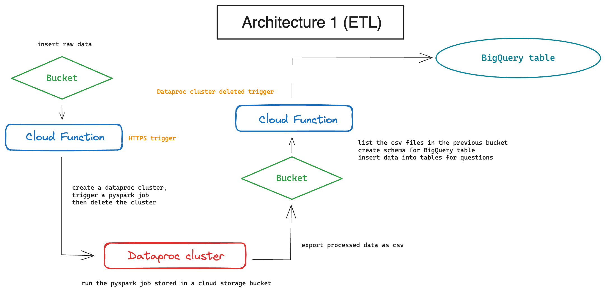

# Workflow Summary Mini-Project - Pierre RAGEOT

## Objectives
The goal is to efficiently transform and analyze data, respond to supervisor questions, and visualize results through a streamlined cloud-based process using Google Cloud Platform.

## Architecture 1 (ETL)

## Workflow Steps

1. **Temporary Spark Cluster Creation**
   - Spawn a Cloud function (click on the following link to start the pipeline ***https://europe-west2-mini-project-pierrerageot.cloudfunctions.net/function-trigger-script*** | 4-minute wait) that create a temporary Spark cluster, run a pyspark script in it, then delete the cluster automatically once the job is done. This function use a HTTPS trigger. 
   - Utilize the Spark cluster (***my-dataproc-cluster2***) to transform data and get the result for each questions, using a pyspark script uploaded in the following bucket ***https://console.cloud.google.com/storage/browser/bucketscript;tab=objects?forceOnBucketsSortingFiltering=true&authuser=3&project=mini-project-pierrerageot&supportedpurview=project***. This script read and process a CSV file stored in another bucket ***https://console.cloud.google.com/storage/browser/bucketinputcsv;tab=objects?forceOnBucketsSortingFiltering=true&authuser=3&project=mini-project-pierrerageot&supportedpurview=project***.

2. **Data Storage**
   - The script called by the Cloud function save the transformed datasets as CSV files.
   - A bucket is specified for storing these CSV files (***https://console.cloud.google.com/storage/browser/bucketoutputcsv;tab=objects?forceOnBucketsSortingFiltering=true&authuser=3&project=mini-project-pierrerageot&supportedpurview=project***).

3. **BigQuery Table Creation**
   - Then, a different Cloud function is called (***function-bigquery***) to create BigQuery tables for each supervisor question. This function is launch by the deletion of the previous Spark cluster, using a ***google.cloud.dataproc.v1.ClusterController.DeleteCluster*** trigger. 
   - Utilize the transformed data from the specified bucket for table creation.
   - Insert data into the table.

4. **Orchestration**
   - Orchestrate the entire workflow using Cloud Scheduler. (not used for this architecture)

## End Result

You can see the result in the dataset raw_dataset : ***https://console.cloud.google.com/bigquery?referrer=search&authuser=3&project=mini-project-pierrerageot&supportedpurview=project&ws=!1m0***

This orchestrated workflow ensures that data transformation and BigQuery table creation are seamlessly executed in response to supervisor questions, providing an efficient and organized solution.

## Review

Here is some improvements that could be integrated in the future : 

   - Instead of hardcoding the schema for each table, we might consider storing the schema information in a configuration file or a database. This can make the code more maintainable, especially if we plan to add more tables in the future.

   - BigQuery has quotas and limits on the number of tables we can create per day. We need to be aware of these limitations and consider alternative approaches if we have a high volume of tables.

   - In the script, we might save the transformed datasets as parquet files to increase speed processing in BigQuery. In our case, it is not necessary because the files are not too big.

## Architecture 2 (ELT)

## Workflow Steps

   - The major idea of this architecture is to set a Cloud function that will transfer directly the raw data (the content of the CSV file) in a BigQuery table with a Spark cluster.

   - Once, the data is stored in the "big" table, we are doing the SQL query for each questions directly from it. Each question will have its own schema and table.

1. **Temporary Spark Cluster Creation**
   - Spawn a Cloud function (click on the following link to start the pipeline ***https://europe-west2-mini-project-pierrerageot.cloudfunctions.net/function-archi2*** | 4-minute wait) that create a temporary Spark cluster, run a pyspark script in it, then delete the cluster automatically once the job is done. This function use a HTTPS trigger. 
   - Utilize the Spark cluster (***my-dataproc-cluster3***) to transfer the raw data in a BigQuery table, using a pyspark script uploaded in the following bucket ***https://console.cloud.google.com/storage/browser/bucketscript2;tab=objects?forceOnBucketsSortingFiltering=true&authuser=3&project=mini-project-pierrerageot&supportedpurview=project***. 

2. **Data Storage**
   - The script called by the Cloud function import the raw data to BigQuery. Then it creates a new dataset and BigQuery tables for each supervisor question. Finally, it runs the SQL queries.
   - The storage here is directly the raw table that contains the raw data. 

## End Result

You can see the result in the dataset archi2 (raw data) : ***https://console.cloud.google.com/bigquery?referrer=search&authuser=3&project=mini-project-pierrerageot&supportedpurview=project&ws=!1m0*** and in the dataset archi2_processed (queries)

This orchestrated workflow ensures that data transfer, BigQuery table creation, and data transformation are seamlessly executed in response to supervisor questions, providing an efficient and organized solution.
